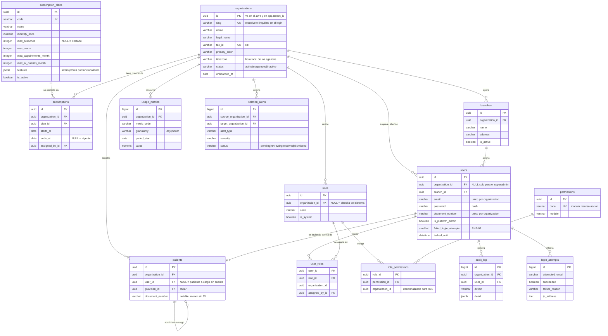

# Modelo de datos — Sprint 0

> **Los tres archivos de esta carpeta, y para qué sirve cada uno**
>
> | Archivo | Qué es | ¿Se ejecuta? |
> |---|---|---|
> | `sprint-0.md` | este documento: las decisiones y el porqué | — |
> | `esquema-generado.sql` | el DDL **real**, salida de `manage.py sqlmigrate`. Es el que va a la documentación del proyecto | **no** |
> | `sprint-0.sql` | el borrador de diseño con el que se acordó el modelo, previo a Django | **no** |
>
> El esquema se aplica **siempre** con `python manage.py migrate`. Ninguno de
> los dos `.sql` se ejecuta: si se corrieran, Django después querría crear
> tablas que ya existen.
>
> `esquema-generado.sql` se regenera con `python scripts/generar_esquema.py`
> cada vez que se agrega una migración.

Historias cubiertas: **US-43, US-44, US-45, US-01, US-02, US-04**
(las seis del Sprint 0 según el apartado 3.11 del documento del proyecto).

Este documento es la referencia común de los seis integrantes antes de escribir
la primera migración. El DDL equivalente está en [`sprint-0.sql`](sprint-0.sql)
y fue **validado contra PostgreSQL 16 con pgvector**, el mismo contenedor que
levanta `docker compose up -d`. Las pruebas de aislamiento están al final.

> La fuente de verdad del esquema son las migraciones de Django. El `.sql`
> existe para acordar el modelo, poder probarlo y copiar las políticas RLS a
> una migración `RunSQL`.

---

## 1. Reparto por integrante

| Historia | Integrante | Tablas de las que es responsable |
|---|---|---|
| US-43 | Luis Mateo Hurtado | `organizations` + el alta que clona los roles del sistema |
| US-44 | José Daniel Iporo | `subscription_plans`, `subscriptions` |
| US-45 | Luis Miguel Aguayo | `usage_metrics`, `isolation_alerts`, vista `v_organization_current_plan` |
| US-01 | Alexander Osinaga | `users` (alta), `patients` (mínima) |
| US-02 | Karen Ortega | `users` (autenticación), `login_attempts` |
| US-04 | Michael Mamani | `roles`, `permissions`, `role_permissions`, `user_roles`, `audit_log` |

Tres tablas las tocan varios: `users` la comparten Alexander y Karen,
`organizations` la crea Luis Mateo y la leen todos, y `branches` la crea quien
tome US-11 en el Sprint 1. **Esas tres se acuerdan antes de abrir la rama**,
no en el pull request.

---

## 2. Decisiones tomadas

Cada una resuelve una ambigüedad que aparecía en las dos propuestas recibidas.

### D-1 · Nombres en inglés, `snake_case`, plural

`subscription_plans`, no `PlanSuscripcion`. Razones: es la convención de Django
y de DRF, y el apartado 1.1.B del documento dice que el modelo se diseña
"inspirado en la nomenclatura HL7 FHIR" — cuyos recursos (`Patient`,
`Practitioner`, `Appointment`, `Encounter`) son en inglés. Mezclar los dos
idiomas es lo único que no se puede hacer.

Los comentarios, la documentación y la interfaz siguen en español.

### D-2 · `organizations` **es** la tabla de inquilinos, y por eso no lleva `tenant_id`

Es el registro de los inquilinos, no un dato de un inquilino. Se divide el
modelo en dos niveles:

- **Nivel plataforma** — `subscription_plans`, `organizations`, `subscriptions`,
  `usage_metrics`, `isolation_alerts`, `login_attempts`. Las administra el
  Superadministrador.
- **Nivel organización** — `branches`, `users`, `roles`, `permissions`,
  `role_permissions`, `user_roles`, `patients`, `audit_log`. Llevan
  `organization_id` y RLS.

### D-3 · El superadministrador **no** puede leer datos de ninguna organización

El alcance (módulo 1) dice: *"Rol de Superadministrador de Plataforma, sin
acceso a información clínica de ninguna organización"*. Eso se hace cumplir en
la base, no sólo en la aplicación: las políticas de las tablas de inquilino
**no** tienen excepción para el superadmin. Ve organizaciones, planes, métricas
agregadas y alertas; no ve usuarios, pacientes ni historias clínicas.

Consecuencia para US-45: el panel se alimenta de `usage_metrics`, que son
agregados precalculados, **no** de contar filas en las tablas de cada inquilino.
Además de correcto, es lo único que escala: contar en vivo sobre N inquilinos
recorre toda la base en cada carga del panel.

### D-4 · `users` no lleva un campo `role`

La propuesta de US-44 traía `users.role` como texto. No alcanza:

- **US-04 y RF-W-02** piden que el administrador *gestione* roles y permisos, no
  que elija de una lista fija. Un `varchar` obliga a un despliegue para cambiar
  qué puede hacer un rol.
- **CU5** se llama, literalmente, "Gestión de Roles y Permisos".
- Una persona puede tener dos roles a la vez (médico que además administra).

Por eso: `roles` → `role_permissions` → `permissions`, y `user_roles` para la
asignación. Los cinco roles del documento existen como **plantillas del sistema**
(`organization_id IS NULL`, `is_system = true`) que US-43 clona dentro de cada
organización nueva, para que su administrador pueda ajustarles los permisos sin
afectar a los otros inquilinos.

### D-5 · La unicidad es **por inquilino**, nunca global

`UNIQUE (organization_id, document_number)` y `UNIQUE (organization_id, email)`.
La misma persona puede ser paciente en dos centros médicos distintos, y con un
único global el segundo registro fallaría con un error incomprensible.

Esto tiene una consecuencia directa **para Karen (US-02)**: el login no puede
resolverse sólo con correo y contraseña, porque el mismo correo puede existir en
dos organizaciones. El formulario necesita un tercer dato que identifique al
inquilino → el campo `organizations.slug` (subdominio en web, selector en móvil).
El orden es:

1. resolver la organización por `slug`,
2. `SET LOCAL app.tenant_id`,
3. recién entonces buscar el usuario.

El superadministrador entra por un endpoint aparte que hace
`SET LOCAL app.is_platform_admin = 'on'`, porque su `organization_id` es `NULL`.

### D-6 · `patients` es distinto de `users`, y se crea ahora aunque sea del Sprint 1

Un paciente a cargo (US-07: un menor, un adulto mayor) **no tiene cuenta**: existe
como paciente pero no como usuario. Si US-01 guarda los datos del paciente dentro
de `users`, el Sprint 1 tiene que migrar datos ya cargados.

Se crea `patients` mínima ahora (`user_id` nulable, `guardian_id` para el
titular). US-01 crea *dos* filas: el `users` de la cuenta y el `patients` del
titular. Los campos clínicos (alergias, condiciones crónicas — US-08) se agregan
en el Sprint 1.

Lo mismo con `branches`: es US-11, pero `users.branch_id` la necesita, así que se
crea mínima.

### D-7 · `subscriptions` como historial, no `plan_id` dentro de `organizations`

La propuesta de US-44 ponía `subscription_plan_id` directo en `organizations`.
Funciona para saber el plan de hoy, pero pierde cuándo cambió y quién lo cambió —
y US-45 pide "uso por plan", que sin fechas no se puede reconstruir.

`subscriptions` guarda `starts_at` / `ends_at`, y un índice único parcial
garantiza en la base que hay **una sola** suscripción vigente por organización:

```sql
CREATE UNIQUE INDEX uq_subscription_active
    ON subscriptions (organization_id) WHERE ends_at IS NULL;
```

La vista `v_organization_current_plan` devuelve el plan vigente ya resuelto,
para el panel de US-45.

### D-8 · Los límites del plan son columnas; las funcionalidades, JSONB

Las dos cosas, porque sirven para cosas distintas:

- `max_users`, `max_branches`, `max_appointments_month`… → columnas numéricas
  (`NULL` = ilimitado). Se comparan contra `usage_metrics` para mostrar el
  consumo del plan. En JSONB no se pueden indexar ni comparar cómodamente.
- `features` JSONB → interruptores (`ai_chatbot`, `noshow_prediction`,
  `report_export`). Agregar una funcionalidad nueva no debe requerir una migración.

### D-8b · Vocabulario de `usage_metrics.metric_code`

La columna sólo valida el **formato** (`^[a-z][a-z0-9_]{2,39}$`), no una lista
cerrada: cada sprint agrega métricas y una lista fija obligaría a un `ALTER` en
la base compartida cada vez. El vocabulario se acuerda aquí:

| Código | Unidad | Desde |
|---|---|---|
| `active_users` | usuarios | Sprint 0 |
| `branches` | sucursales | Sprint 1 |
| `active_practitioners` | profesionales | Sprint 1 |
| `appointments_created` | fichas | Sprint 2 |
| `appointments_noshow` | fichas | Sprint 2 |
| `revenue` | BOB | Sprint 2 |
| `storage_mb` | MB | Sprint 2 |
| `ai_queries` | consultas | Sprint 3 |

Agregar una métrica es agregar una fila a esta tabla y una línea a la tarea
programada. Ningún cambio de esquema.

### D-9 · `varchar` + `CHECK` en vez de tipos `ENUM` de PostgreSQL

Los `ENUM` nativos son incómodos de evolucionar desde migraciones de Django.
`status varchar(12) CHECK (status IN (...))` da la misma garantía y se
corresponde uno a uno con `choices` del ORM.

### D-10 · `timestamptz`, siempre

Nunca `timestamp` a secas. Bolivia es UTC−4 y el sistema maneja horarios de
atención, recordatorios y ventanas de cancelación. Un `timestamp` sin zona en el
módulo de agendas es un error que aparece recién en la demostración.

---

## 3. Diagrama entidad-relación



---

## 4. Qué se integró de cada propuesta

### De la propuesta de US-45 (Luis Miguel)

| Propuesto | Resultado |
|---|---|
| Organizacion (Tenant) | `organizations` — se agregaron `slug`, `status` y campos institucionales |
| PlanSuscripcion | `subscription_plans` — límites como columnas y `features` JSONB (D-8) |
| Organizacion_Plan **o** `plan_id` en Organizacion | Se eligió la tabla: `subscriptions`, con historial (D-7) |
| MetricaUso | `usage_metrics` — con `granularity` y unicidad por período |
| AlertaAislamiento | `isolation_alerts` — con `source`/`target`, endpoint e IP |
| Usuario (del módulo de otro) | `users`, compartida con US-01/US-02 |

El planteo estaba bien encaminado. Dos ajustes: `MetricaUso` necesita
`granularity` y una clave única `(organización, métrica, granularidad, período)`
para que el recálculo sea idempotente y no duplique filas si el job corre dos
veces; y `AlertaAislamiento` necesita guardar el `endpoint` y la IP, porque una
alerta sin eso no se puede investigar.

### De la propuesta de US-44 (Daniel)

| Propuesto | Resultado |
|---|---|
| `subscription_plans` | Aceptada. Se cambió `features` de texto a JSONB y se agregaron los límites numéricos |
| `organizations` | Aceptada casi entera. Se le quitó `subscription_plan_id` (D-7) y se le agregó `slug` (D-5) |
| `branches` | Aceptada tal cual, aunque es del Sprint 1 (US-11) |
| `users` | Aceptada con cuatro cambios (abajo) |

Cambios sobre `users`:

1. **`role` sale.** Reemplazado por `user_roles` (D-4).
2. **`is_staff` / `is_superuser` salen.** Son de `django.contrib.auth` y no
   representan a nuestro Superadministrador de Plataforma, que es un concepto de
   negocio. Queda `is_platform_admin`, con un `CHECK` que garantiza que es
   exactamente el usuario sin organización.
3. **`username` sale.** El documento no lo pide en ningún lado; US-01 y US-02
   hablan de documento y credenciales. Un identificador de más es un campo más
   que validar y que puede quedar desincronizado.
4. **`email` y `document_number` pasan a ser únicos por organización** (D-5).

Se agregaron `failed_login_attempts` y `locked_until`, que RNF-07 exige y no
estaban en ninguna de las dos propuestas.

---

## 5. Aislamiento — cómo queda

El middleware abre una transacción por petición y fija el contexto:

```sql
BEGIN;
  SET LOCAL app.tenant_id         = '11111111-...';   -- uuid de la organización
  SET LOCAL app.is_platform_admin = 'on';             -- SÓLO para el superadmin
  -- consultas
COMMIT;
```

`SET LOCAL`, nunca `SET`: con `SET` a secas el valor sobrevive al `COMMIT`, la
conexión vuelve al pooler arrastrando el inquilino anterior y la petición
siguiente lee datos ajenos. Está explicado en el punto 3 del README.

Las políticas usan dos funciones de apoyo:

```sql
app_current_tenant()     -- NULLIF(current_setting('app.tenant_id', true), '')::uuid
app_is_platform_admin()  -- current_setting('app.is_platform_admin', true) = 'on'
```

El segundo argumento `true` de `current_setting` es lo que evita que reviente
cuando la variable no está definida. Sin contexto, la política compara contra
`NULL`, ninguna comparación con `NULL` es verdadera, y la consulta devuelve
**cero filas** — deliberadamente, para que un middleware roto no devuelva todo.

Toda tabla con `organization_id` lleva `ENABLE` **y** `FORCE`. `ENABLE` sola no
alcanza: Django corre las migraciones como `app_user`, así que `app_user` es
dueño de las tablas, y el dueño queda exento de sus propias políticas.

---

## 6. Verificación

El DDL se validó contra el contenedor del proyecto, **ejecutándolo como
`app_user`** —que es como lo correrá Django— y no como `postgres`:

```bash
docker compose exec -T db psql -U app_user -d plataforma -v ON_ERROR_STOP=1 \
  -f - < docs/modelo-datos/sprint-0.sql
docker compose exec db psql -U app_user -d plataforma -c "\dt"
```

Las 14 tablas quedan con `Owner = app_user`, igual que quedarán tras
`manage.py migrate`.

Resultado sobre PostgreSQL 16.15: **14 tablas, 1 vista, 2 funciones, 23 políticas
RLS, 25 permisos y 5 plantillas de rol**, sin un solo error.

De las 14 tablas, 13 tienen `ENABLE` **y** `FORCE ROW LEVEL SECURITY`. La única
sin RLS es `permissions`, a propósito: es un catálogo global del sistema, no
tiene `organization_id` y su contenido es el mismo para todos los inquilinos.
Se puede comprobar con:

```sql
SELECT relname FROM pg_class c JOIN pg_namespace n ON n.oid = c.relnamespace
WHERE n.nspname = 'public' AND c.relkind = 'r'
  AND NOT (c.relrowsecurity AND c.relforcerowsecurity);
-- debe devolver únicamente: permissions
```

Doce comprobaciones de aislamiento, todas con el resultado esperado:

| # | Comprobación | Resultado |
|---|---|---|
| 1 | El inquilino A ve sólo sus usuarios | 1 fila, la suya |
| 2 | El inquilino A busca al usuario de B | 0 filas |
| 3 | Sin `app.tenant_id` definido | 0 filas, no todas |
| 4 | A intenta insertar una fila del inquilino B | rechazado por la política RLS |
| 5 | El superadmin lista organizaciones | las 2 |
| 6 | El superadmin lista usuarios | 1 — sólo él mismo, ningún usuario de inquilino |
| 7 | El inquilino A lee `organizations` | 1 — sólo su propia ficha |
| 8 | `app_user` intenta borrar de la bitácora | `permission denied` (RNF-18) |
| 9 | Dos suscripciones vigentes en la misma organización | rechazado por índice único |
| 10 | Un superadmin con `organization_id` | rechazado por `ck_user_scope` |
| 11 | Vista del panel de US-45 | devuelve plan y límites vigentes |
| 12 | Usuario con sucursal de otra organización | rechazado por clave foránea compuesta |

Las comprobaciones 4, 8 y 12 son las que hay que convertir en pruebas de Pytest:
son el criterio 4 de la Definición de Terminado.

### 6.1 · Cinco defectos que encontró la segunda pasada

La primera versión de este modelo se probó como `postgres`. **`postgres` es
superusuario y omite RLS aunque haya `FORCE`**, así que las políticas nunca se
ejercitaron de verdad. Al repetir las pruebas como `app_user` —que es como se
conecta Django— aparecieron cinco defectos que habrían bloqueado cuatro
historias del sprint. Están corregidos y reverificados.

| # | Síntoma | Historia bloqueada | Corrección |
|---|---|---|---|
| 1 | El middleware no podía **insertar** en `isolation_alerts`: la política exigía ser superadmin, pero quien detecta un acceso cruzado está en el contexto de un inquilino | US-45 | Política `anyone_reports` (`FOR INSERT WITH CHECK (true)`); leer y resolver siguen siendo exclusivos del superadmin |
| 2 | Lo mismo en `login_attempts`: un login fallido se registra **antes** de saber a qué organización pertenece el correo | US-02, RNF-07 | Igual que el anterior |
| 3 | El superadmin no podía auditar sus propias acciones: `audit_log` sólo aceptaba filas de un inquilino | US-43, US-44 | `audit_log` admite `organization_id NULL` para acciones de plataforma, con el mismo patrón que `users` |
| 4 | La migración semilla no podía insertar las plantillas de rol: Django corre las migraciones como `app_user`, sujeto a RLS | US-04 | Política `system_templates_write` para el superadmin; la migración debe empezar con `SET LOCAL app.is_platform_admin = 'on'` |
| 5 | `patients.document_number` era `NOT NULL`: un menor sin CI no se podía registrar | US-07 (Sprint 1) | Columna nulable, índice único parcial, y `CHECK` que exige documento **o** titular |

Verificado después de corregir: las 12 pruebas anteriores siguen pasando, y las
7 nuevas dan el resultado esperado —incluidas las negativas, que confirman que
un inquilino sigue sin poder colar una plantilla de rol del sistema y que un
paciente sin documento **y** sin titular sigue siendo rechazado.

**Regla que queda para el equipo:** ninguna prueba de aislamiento vale si se
corre como `postgres`. Pytest se conecta como `app_user`. Es el punto 1 del
README y acaba de costarnos cinco defectos.

### 6.2 · Dos defectos más, que sólo aparecieron con Django encima

El SQL suelto no ejercita todo. Al implementar los modelos y correr las
pruebas aparecieron dos problemas que el `.sql` no podía mostrar:

**6. `SET LOCAL` no se deshace al salir de un bloque anidado.**
Vive hasta el fin de la **transacción**, no del bloque: salir de un
`atomic()` anidado libera el savepoint pero deja el parámetro puesto. Los
gestores de contexto ponían el valor y nunca lo restauraban, así que un
`platform_admin_context()` abierto al principio de una transacción seguía
vigente durante todo el resto — con permisos de superadministrador. En
producción, cualquier petición que cambiara de contexto habría arrastrado
esos permisos.

Corregido en `tenancy/context.py`: cada gestor guarda los dos parámetros al
entrar y los restaura al salir, y fija **ambos** (entrar al contexto de un
inquilino apaga el de plataforma, y al revés).

**7. `INSERT ... RETURNING` exige pasar también la política de `SELECT`.**
Los buzones de sólo escritura (`isolation_alerts`, `login_attempts`) permiten
insertar a cualquiera y leer sólo al superadministrador. Pero Django usa
`INSERT ... RETURNING id` para recuperar una clave `bigserial`, y `RETURNING`
lee la fila — con lo cual chocaba contra la política de lectura. El patrón
"buzón" no funciona con claves autogeneradas por la base.

Corregido dándoles clave **UUID generada en Python**: con la clave ya puesta,
Django hace un `INSERT` a secas y no necesita `RETURNING`.

Las 21 pruebas de `backend/tests/test_isolation.py` cubren los siete defectos.
Cada una fallaba antes de su corrección.

---

## 7. ¿Alcanzan 14 tablas? Compatibilidad con los sprints que vienen

### 7.1 · Para el Sprint 0: sí, con dos aclaraciones

Cada historia del sprint queda cubierta:

| Historia | Tablas | Estado |
|---|---|---|
| US-43 | `organizations`, `subscriptions`, clonado de `roles` | completa |
| US-44 | `subscription_plans`, `subscriptions` | completa |
| US-45 | `usage_metrics`, `isolation_alerts`, `v_organization_current_plan` | completa |
| US-01 | `users`, `patients` | completa |
| US-02 | `users`, `login_attempts` | completa |
| US-04 | `roles`, `permissions`, `role_permissions`, `user_roles`, `audit_log` | completa |

Las dos aclaraciones:

1. **Django y sus librerías agregan tablas propias**, que no contamos entre las
   14: `django_migrations`, `django_content_type`, `auth_permission`,
   `auth_group`, y —si se usa `djangorestframework-simplejwt` con lista negra,
   necesaria para CU4 *Terminación de Sesión*— `token_blacklist_outstandingtoken`
   y `token_blacklist_blacklistedtoken`. En la base real habrá unas 22 tablas.

2. **No usar el sistema de permisos de `django.contrib.auth`.** Se mantiene la
   app instalada porque de ahí salen `AbstractBaseUser` y los hashers, pero
   `auth_permission` y `auth_group` **no** están aislados por inquilino. La
   autorización pasa por nuestras tablas. Concretamente: nada de `user.has_perm()`
   ni `@permission_required`; el chequeo va contra `user_roles → role_permissions`.
   Si alguien mezcla los dos sistemas, el aislamiento se rompe sin dar error.

### 7.2 · Qué agrega cada sprint

Ninguna tabla del Sprint 0 hay que rehacerla. Lo que viene es **agregar** tablas
y, en dos casos, agregar columnas:

| Sprint | Tablas nuevas | Cambios a tablas del Sprint 0 |
|---|---|---|
| 1 (US-03, 05–16) | `password_reset_tokens`, `patient_conditions`, `specialties`, `practitioners`, `practitioner_specialties`, `practitioner_branches`, `schedules`, `schedule_blocks` | `branches` + horario de atención; `patients` + datos demográficos |
| 2 (US-17–25) | `appointments`, `payments`, `encounters`, `appointment_status_history` | ninguno |
| 3 (US-26–34) | `prescriptions`, `prescription_items`, `lab_orders`, `notifications`, `knowledge_chunks` (pgvector), `chat_sessions`, `chat_messages` | ninguno |
| 4 (US-35–42) | `noshow_predictions`, `model_versions`, `ai_generated_texts` | ninguno |

Total proyectado: **unas 37 tablas propias** al cierre del Sprint 4.

### 7.3 · Cuatro riesgos declarados ahora para no pagarlos después

**R-1 · `practitioners` es una tabla aparte de `users`, igual que `patients`.**
Un médico es dos cosas: una cuenta que inicia sesión y una entidad de catálogo
que aparece en el directorio, tiene especialidad y agenda. Puede existir en el
catálogo antes de tener cuenta. **En el Sprint 0 no se agrega nada de médicos a
`users`** —ni `specialty`, ni `license_number`. Si se agrega, US-12 tiene que
migrar datos ya cargados.

**R-2 · La tarea de métricas de US-45 no puede leer los datos de los inquilinos.**
Es consecuencia directa de la decisión D-3, y está comprobado: con
`app.is_platform_admin = 'on'`, `SELECT count(*) FROM users` devuelve **0**. La
tarea tiene que recorrer organización por organización:

```
para cada organización activa:
    BEGIN; SET LOCAL app.tenant_id = <uuid>;  contar;  COMMIT;
escribir todo junto:
    BEGIN; SET LOCAL app.is_platform_admin = 'on';  INSERT en usage_metrics;  COMMIT;
```

No es una limitación a sortear: es la garantía de que el superadministrador no
lee historias clínicas. **Luis Miguel tiene que saber esto antes de empezar.**

**R-3 · pgvector en Supabase vive en el esquema `extensions`, no en `public`.**
Recién importa en el Sprint 3, pero si `app_user` no tiene
`search_path = public, extensions` las migraciones fallan con un error que no
menciona el `search_path`. Ya está contemplado en `init-db/01-app-user.sql`
para local; hay que replicarlo en Supabase.

**R-4 · Toda tabla nueva con `organization_id` repite el mismo patrón.**
`ENABLE` + `FORCE` + política `tenant_isolation`, y clave foránea **compuesta**
`(x_id, organization_id)` cuando referencia a otra tabla del inquilino —es lo
que impide, por ejemplo, agendar una ficha de un paciente de otra organización.
La prueba 12 muestra el patrón funcionando.

---

---

## 8. Lo que queda por decidir

1. **`slug` en móvil.** En web sale del subdominio. En la app, el paciente tiene
   que elegir el centro médico la primera vez. Definir esa pantalla con el
   Product Owner antes de que Karen cierre US-02.
2. **Precios de los planes.** Los valores del `INSERT` semilla (350 / 890 / 1750
   BOB) son marcadores de posición. Los define el Product Owner.
3. **Nomenclatura FHIR en el Sprint 1.** `patients` ↔ `Patient` ya coincide.
   Falta acordar `practitioners`, `appointments` y `encounters` antes de US-12.
4. **Datos semilla de demostración.** Ninguno todavía. Cuando se hagan: nombres
   ficticios, sin datos de personas reales, como dice el README.
